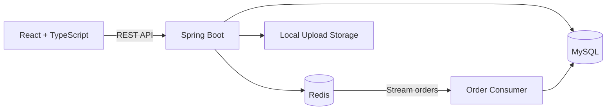
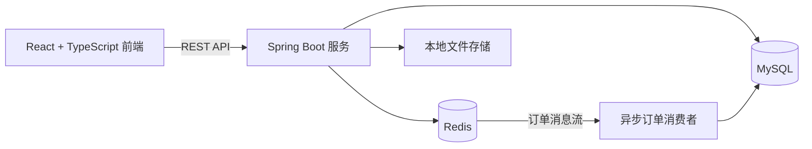

# NearBite | 寻味生活

[English](#english) · [中文](#中文)

NearBite is a full-stack local business discovery and flash-deals platform. It combines nearby merchant search, social recommendations, user engagement, and high-concurrency voucher ordering in one responsive application.

NearBite（寻味生活）是一套全栈本地生活发现与限时优惠平台，集附近商户搜索、探店内容社区、用户互动和高并发优惠券抢购于一体。

## English

### Features

- Phone OTP authentication with Redis-backed sessions and sliding expiration
- Nearby business discovery using Redis GEO radius queries
- Merchant categories, profiles, search, favorites, and deal vouchers
- Social discovery feed with likes, follows, common follows, and scroll pagination
- Daily check-ins and streak calculation using Redis Bitmap
- Flash-sale ordering with Lua validation, Redis Streams, Redisson locks, and transactional persistence
- Responsive React interface with live API integration and offline sample data

### Architecture



### Redis Design

- **Cache resilience:** cache-aside queries, null caching, or cache pass-through, mutex-based rebuilds, and logical expiration
- **Atomic flash sales:** a Lua script validates inventory and duplicate purchases before decrementing stock and publishing an order event
- **Asynchronous ordering:** Redis Stream consumer groups process orders with pending-list recovery
- **Purpose-built structures:** GEO for proximity search, ZSET for likes and feed ordering, Bitmap for check-ins, and SET for relationship intersections

### Tech Stack

| Layer | Technologies |
| --- | --- |
| Frontend | React 19, TypeScript, Vinext, Tailwind CSS 4, shadcn/ui |
| Backend | Java, Spring Boot, Spring MVC, MyBatis-Plus |
| Data | MySQL 8, Redis, Redisson, Lua, Redis Streams |
| Tooling | Maven, pnpm, Docker Compose |

### Repository Structure

```text
.
├── backend/    Spring Boot REST API, SQL schema, and Lua scripts
├── frontend/   Responsive React web application
└── docker-compose.yml
```

### Quick Start

#### Prerequisites

- JDK 8 or later
- Maven 3.6+
- Node.js 22+
- pnpm
- Docker and Docker Compose

#### 1. Start MySQL and Redis

```bash
docker compose up -d
```

The development containers expose MySQL on `3306` and Redis on `6379`. The SQL schema and sample records are initialized automatically.

#### 2. Start the backend

```bash
cd backend
mvn spring-boot:run
```

The API runs at `http://localhost:8081`. Connection settings can be overridden with:

- `NEARBITE_DB_URL`
- `NEARBITE_DB_USERNAME`
- `NEARBITE_DB_PASSWORD`
- `NEARBITE_REDIS_HOST`
- `NEARBITE_REDIS_PORT`
- `NEARBITE_REDIS_PASSWORD`
- `NEARBITE_REDIS_DATABASE`

#### 3. Start the frontend

```bash
cd frontend
pnpm install
pnpm dev
```

Open `http://localhost:3000`. During local development, `/api` is proxied to `http://localhost:8081`. Set `NEXT_PUBLIC_API_BASE_URL` when using a different API endpoint.

---

## 中文

### 核心功能

- 手机验证码登录，基于 Redis 保存会话并自动续期
- 使用 Redis GEO 按距离查询附近商户
- 商户分类、关键词搜索、详情、收藏与优惠券
- 探店内容流、点赞、关注、共同关注和滚动分页
- 基于 Redis Bitmap 的每日签到与连续签到统计
- 使用 Lua、Redis Streams、Redisson 和数据库事务实现高并发优惠券抢购
- 响应式 React 页面，支持真实后端数据与离线示例数据

### 系统架构



### Redis 方案

- **缓存治理：** Cache Aside、缓存空值、互斥锁重建和逻辑过期，降低缓存穿透与击穿风险
- **原子秒杀：** Lua 脚本一次完成库存判断、重复下单校验、库存扣减与订单消息写入
- **异步订单：** Redis Stream 消费者组处理订单，并支持 Pending List 异常恢复
- **数据结构：** GEO 实现附近搜索，ZSET 实现点赞排行与 Feed 流，Bitmap 统计签到，SET 计算共同关注

### 技术栈

| 模块 | 技术 |
| --- | --- |
| 前端 | React 19、TypeScript、Vinext、Tailwind CSS 4、shadcn/ui |
| 后端 | Java、Spring Boot、Spring MVC、MyBatis-Plus |
| 数据 | MySQL 8、Redis、Redisson、Lua、Redis Streams |
| 工具 | Maven、pnpm、Docker Compose |

### 目录结构

```text
.
├── backend/    Spring Boot 接口、数据库脚本与 Lua 脚本
├── frontend/   响应式 React 前端
└── docker-compose.yml
```

### 本地启动

#### 1. 启动 MySQL 和 Redis

```bash
docker compose up -d
```

开发容器分别使用 `3306` 和 `6379` 端口，首次启动时会自动初始化数据库结构和示例数据。

#### 2. 启动后端

```bash
cd backend
mvn spring-boot:run
```

后端默认运行在 `http://localhost:8081`，数据库与 Redis 连接参数均可通过上文列出的环境变量覆盖。

#### 3. 启动前端

```bash
cd frontend
pnpm install
pnpm dev
```

浏览器访问 `http://localhost:3000`。本地开发时，前端会将 `/api` 请求代理到 `http://localhost:8081`；如后端部署在其他地址，可配置 `NEXT_PUBLIC_API_BASE_URL`。
